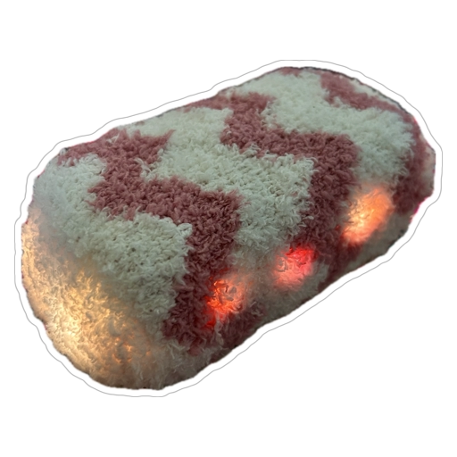

# 2306514_COMP304
# Smushie – Companion Emotion Robot

  

## Project Description

Smushie is a small companion robot designed to help calm and centre the user, similar to a comforting pet.  
It quietly monitors the environment, and when it detects signs that the user may be distressed, it activates coloured light patterns and gentle vibration to invite interaction by touch. Touching and patting Smushie during these responses provides feedback that it uses to adapt which patterns it shows in the future. 

---

## Aims and Motivation

- Explore how a simple social robot can support emotional comfort using light and touch rather than speech.  
- Model a basic form of affect sensing (distress vs. non‑distress) from audio.  
- Demonstrate how a robot can learn user preferences over time from interaction (touch feedback). 

---

## System Overview

### Hardware

- Raspberry Pi Pico microcontroller.  
- WS2812/NeoPixel LED strip mounted inside the robot body.  
- Capacitive touch sensors mounted on the shell where the user can rest or pat their hand.  
- Small DC vibration motor attached to the enclosure.  
- USB connection to a host computer which provides power and communication. [Future work - RassberryPi Zero 2]

### Software Architecture

- **Python (PC side)**  
  - Captures audio from a microphone.  
  - Runs emotion/distress detection over short audio windows.  
  - Maintains simple preference scores over emotion–pattern combinations.  
  - Sends commands to the Pico (`H0`, `S1`, `A0`) and receives touch events back. 

- **Pico firmware (C++ / Arduino‑style)**  
  - Receives commands and maps them to specific light and vibration patterns.  
  - Reads capacitive touch sensors and sends touch events back to the PC.  
  - Drives LED animations and vibration patterns for each emotion.
---

## Emotion and Learning Logic

- Audio is analysed to estimate an **emotion/distress state** (e.g. happy, calm, sad, angry/tense, neutral). 
- For each emotion, there are 2 possible patterns (different colour/vibration combinations). 
- The Python side keeps a simple **score** for each pattern under each emotion. 
- When a pattern is active, and the user touches Smushie, the score for that emotion–pattern pair is increased. 
- Next time the same emotion is detected, Smushie chooses patterns with **higher scores** more often ( greedy or weighted‑random selection).
- Scores are updated in small steps and then normalised into probabilities, so patterns that are touched more often become more likely, while a minimum probability is kept for exploration.
---
## Technical Details
- **Emotion model:** RandomForest classifier trained on the RAVDESS emotional speech dataset using MFCC, chroma, and mel features extracted with librosa.  
  **Dataset:** https://www.kaggle.com/datasets/uwrfkaggler/ravdess-emotional-speech-audio

- **Pattern selection**: e‑greedy strategy per emotion, combining exploitation of the highest‑weight pattern with a small amount of random exploration.

- **Learning rule:** Touch feedback increases the selected pattern’s weight, no touch applies a small decay. Weights are clamped between minimum and maximum values and renormalised so they form a stable probability distribution.
---
## Interaction Summary

- When idle, Smushie remains resting (soft neutral light and light soothing vibration).
- When the system estimates that the user may be distressed, it activates:
  - A suitable light pattern with diffrent colour.  
  - A matching vibration rhythm. 
- The user can then come over and **pat or touch** Smushie, receiving visual and tactile feedback. 
- Touch during a pattern is treated as positive feedback for that pattern, influencing future behaviour.
---

## Data, Metrics and Evaluation

- The system can log **high‑level interaction events**, such as:
  - Time, estimated emotion, chosen pattern index.  
  - Whether a touch was detected during that pattern.  
  - Updated preference scores.
- These logs are used to:
  - Show that the robot is adapting its pattern choices over time.  
  - Provide basic metrics for analysis (e.g. which patterns are preferred for each emotion).
  - Drive a separate analysis script that plots the current pattern‑selection probabilities per emotion, providing a visual check that learning has occurred.

---

## Privacy and Cybersecurity

Smushie has been designed with simple but explicit privacy and cybersecurity considerations.

### Audio Privacy

- Audio is processed in real time to estimate emotional state or distress; raw microphone recordings are not stored as part of normal operation.
- No audio or interaction data are transmitted to external services; all processing happens locally on the project machine.
- The system does not attempt to identify individual users; all interactions are treated anonymously.

### Interaction Logs and Data Handling

- Any logs are limited to high‑level events only: time, emotion label, pattern ID, Yes touch/ No touch, and internal preference scores.
- Logs are stored locally on the development / demo machine for evaluation of the system’s behaviour. 
- Logs can be deleted at any time after testing or demonstration, they are not needed for long‑term user tracking.
- No personal identifiers, names or emails are stored in the logs.
- The project repository does not include any _real_ user data or recordings.

---

## How to Run

1. Clone this repository.  
2. Flash the Pico with the provided firmware sketch.
3. Connect Smushie to the computer via USB.  
4. Run the main Python script (e.g. `python voice_detection.py`). 
5. Interact with Smushie as described in the user guide (place it in the room, allow it to activate when you are distressed, and comfort it by touch). 

---

## Documentation
This repository includes:
- Code for the Python emotion + learning system.
- Firmware for the Pico controlling LEDs, vibration, and touch.
- A Smushie Quick User Guide for end users.
- A poster describing the problem, design, architecture, learning approach, results, and privacy considerations.

---
## Future Work
- **Standalone operation:** Move the full pipeline (audio capture, emotion model, and learning logic) onto an embedded board such as an ESP32 or Raspberry Pi so Smushie can run without a laptop.
- **Stronger security and encryption:** Add encryption on the communication channel and stricter access control for log files to harden the system for deployment beyond a demo environment.
- **Richer form factor:** Explore softer, more organic shapes and materials (e.g. squeezable enclosures, more rounded designs) to make Smushie feel more appealing and comforting to hold.
- **Expanded behaviour set:** Introduce more varied light and vibration patterns per emotion and possibly multimodal cues (e.g. gentle sounds) while keeping behaviour legible and non-intrusive.
- **Longer-term user studies:** Run extended trials with target users (e.g. elderly participants) to evaluate impact on comfort, stress, and acceptance over time, and refine the learning mechanism based on those findings.
